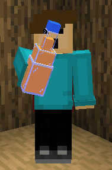

# MaxPax
MCJAVA Resourcepacks

## VanillaTweaks
My VanillaTweaks Pack.

It contains:

* SofterWool
* RedIronGolemFlowers
* StemToLog
* BetterParticles
* HDShieldBanners
* PinkEndRods
* AnimatedCampfireItem
* 2DSpyglass
* ClassicNetheriteArmor
* PlainLeatherArmor
* UniversalLushGrass
* SmootherOakLog
* CircleLogTops
* BetterBedrock
* TwinklingStars
* ShorterGrass
* ShorterTallGrass
* NoCaveSounds
* QuieterConsumables
* QuieterWater
* QuieterNetherPortals
* QuieterRain
* QuieterThunder
* QuieterExplosions
* QuieterDispensersDroppers
* QuieterMinecarts
* QuieterFire
* QuieterPistons
* QuieterBats
* QuieterBees
* QuieterCamels
* QuieterCows
* QuieterChickens
* QuieterCats
* QuieterEndermen
* QuieterPigs
* QuieterPhantoms
* QuieterSheep
* QuieterWolves
* QuieterVillagers
* VisualInfestedStoneItems
* VisualWaxedCopperItems
* ClearBannerPatterns
* HungerPreview
* MusicDiscRedstonePreview
* DirectionalDispensersDroppers
* BetterObservers
* GroovyLevers
* VisibleTripwires
* CompassLodestone
* VisualHoney
* NoteblockBanners
* ArabicNumerals
* SuspiciousSandGravelBorders
* StickyPistonSides
* CleanerWorldBorder
* TransparentPumpkin
* LowerShield
* LowerFire
* 3DBookshelves
* 3DChiseledBookshelves
* 3DLadders
* 3DChains
* 3DPointedDripstone
* 3DAmethyst
* 3DLilyPads
* 3DIronBars
* 3DSugarcane
* 3DRails
* 3DDoors
* 3DTrapdoors
* 3DMushrooms
* 3DVines
* 3DGlowLichen
* 3DStonecutters
* 3DSunMoon
* MoreCrosshairs-4AngledDot
* WitherHearts
* PingColorIndicator
* RainbowExperience
* SmootherFont
* ClassicPanorama
* OldOres
* OldCobblestone
* OldGravel
* OldNetherrack
* OldLava
* OldObsidian
* OldWater
* OldIce
* OldWoolColors
* 1.11ShulkerBoxes
* OldEnchantGlint
* PoppyToRose
* BedIcons
* TerracottatoHardenedClay
* DirtPathToGrassPath
* PotterySherdToShard
* ZombiePigman
* OldDoorSounds
* OldDamageSounds
* OldXpSounds
* OldExplosionSounds
* OldPlanks
* SmileyAxolotls
* Beeralis
* LegacySnowball
* LegacyEmerald
* BedrockDriedKelpItem
* ItemStitchingFix
* DripleafFixBig
* DripleafFixSmall
* ConsistentBucketFix
* CactusBottomFix
* ConsistentTadpoleBucket
* BlazeFix
* SlimeParticleFix
* HoeFix
* CloudFogFix
* ProperBreakParticles
* DirectionalHoppers
* SoulSoilSoulCampfire
* AshlessCampfires
* NoJavaEditionTitle
* ClassicMinecraftLogo
* StoneBackground
* SmoothDirt
* NoBowlParticles
* ItemHoldFix
* RedstonePowerLevels
* CleanRedstoneDust
* 3DRedstoneWire
* NumberedHotbar
* DarkUI
* BrewingGuide
* BlueWidgetsHighlight

## Custom
My custom resourcepack. Mostly just random stuff.

Features:

* "MaxPax" Edition

* clubmate

run the following command to get it:
`/give @p potion{display:{Name:'{"text":"Clubmate","color":"gold","bold":true}'},CustomModelData:1,Potion:"minecraft:water",CustomPotionColor:15440896} 1`

## Among Us Title
sus

Features:

* amongus

